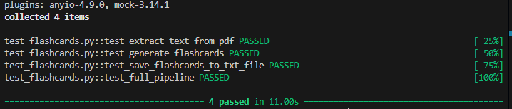
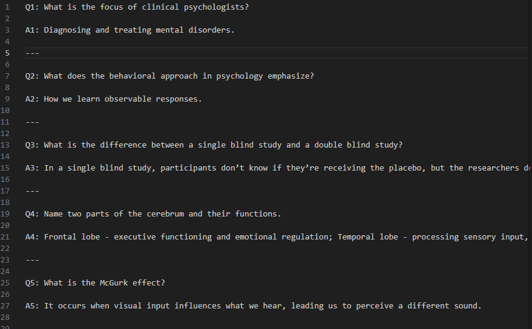

# Flashcard Gernerator

Automatically generate flashcards from your PDF files with LLM (ChatGPT) to help you study efficiently.

## Features
- Generate a specific number of flashcards from any pdf.
- Save flashcards to a text file for easy review.
- Supports regression testing to ensure output consistency.

---

## Getting Started

```bash
    # Install dependencies
    pip install -r requirements.txt

    # Run the project
    python main.py

    # Run tests
    pytest -v
```

## Customization

### Change the instructions for the LLM

You can modify the `instructions` variable in `flashcards.py` to adjust how the questions and answers are generated. For example:

```python
# flashcards.py

instructions = """
        You are a helpful assistant. Based on the following study material
        generate flashcards in Q&A format:
        - Provide clear questions
        - Provide concise answers
        - Use numbering format (Q1, A1, Q2, A2, ...)
    """
```

You can also modify the `amount_of_cards` variable in `flashcards.py` to generate more or fewer flashcards. For example:

```python
# flashcards.py

amount_of_cards = 10
```

### Example Test Results


### Example Generated Flashcards

After running the full pipeline on a PDF, your generated flashcards are saved in tests/output/. Example:

